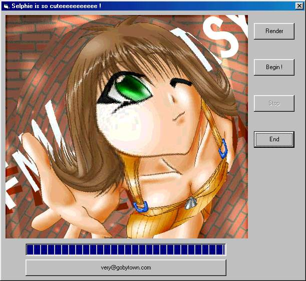

<div align="center">

## Magnifier Glass effect


</div>

### Description

Create maginifier glass effect on any BMP image feature with a little animation
 
### More Info
 
---

Just VB !

???


<span>             |<span>
---                |---
**Submitted On**   |2001-01-09 10:42:44
**By**             |[Very](https://github.com/Planet-Source-Code/PSCIndex/blob/master/ByAuthor/very.md)
**Level**          |Intermediate
**User Rating**    |4.8 (19 globes from 4 users)
**Compatibility**  |VB 6\.0
**Category**       |[Graphics](https://github.com/Planet-Source-Code/PSCIndex/blob/master/ByCategory/graphics__1-46.md)
**World**          |[Visual Basic](https://github.com/Planet-Source-Code/PSCIndex/blob/master/ByWorld/visual-basic.md)
**Archive File**   |[CODE\_UPLOAD13567182001\.zip](https://github.com/Planet-Source-Code/very-magnifier-glass-effect__1-14271/archive/master.zip)

### API Declarations

```
Public Declare Function CreateCompatibleDC Lib "gdi32" (ByVal hdc As Long) As Long
Public Declare Function SelectObject Lib "gdi32" (ByVal hdc As Long, ByVal hobj As Long) As Integer
Public Declare Function GetObjectA Lib "gdi32" (ByVal hobj As Long, ByVal buffsize As Integer, ByRef buff As bitmap) As Long
Public Declare Function StretchBlt Lib "gdi32" (ByVal hdcd As Long, ByVal xd As Long, ByVal yd As Long, ByVal widthd As Long, ByVal heightd As Long, ByVal hdcs As Long, ByVal xs As Long, ByVal ys As Long, ByVal widths As Long, ByVal heights As Long, ByVal opr As Long) As Integer
Public Declare Function LoadImageA Lib "user32" (ByVal hInst As Long, ByVal pfilename As String, ByVal typeimg As Long, ByVal width As Long, ByVal height As Long, ByVal flag As Long) As Long
Public Declare Function BitBlt Lib "gdi32" (ByVal hdcd As Long, ByVal xd As Long, ByVal yd As Long, ByVal widthd As Long, ByVal heightd As Long, ByVal hdcs As Long, ByVal xs As Long, ByVal ys As Long, ByVal opr As Long) As Integer
Public Declare Function CreateCompatibleBitmap Lib "gdi32" (ByVal hdc As Long, ByVal width As Long, ByVal height As Long) As Long
Public Declare Function DeleteDC Lib "gdi32" (ByVal hdc As Long) As Integer
Public Declare Function DeleteObject Lib "gdi32" (ByVal hobj As Long) As Integer
Public Declare Function GetPixel Lib "gdi32" (ByVal hdc As Long, ByVal xs As Long, ByVal ys As Long) As Long
Public Declare Function SetPixel Lib "gdi32" (ByVal hdc As Long, ByVal xd As Long, ByVal yd As Long, ByVal color As Long) As Integer
```


